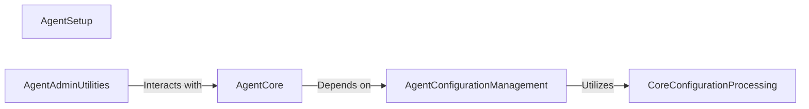

## Component Details

This subsystem manages the core lifecycle and configuration of the New Relic Python Agent. It encompasses the initial setup and installation, dynamic loading and processing of agent-specific and core configuration settings, the central agent lifecycle management (initialization, activation, shutdown), and administrative utilities for agent oversight and debugging.

### AgentCore
Manages the overall lifecycle of the New Relic agent, including initialization, application activation, and shutdown. It interacts with configuration and administrative utilities.

**Related Classes/Methods**:

- `newrelic.core.agent` (full file reference)

### AgentConfigurationManagement
This component handles the loading, mapping, and processing of various configuration settings specific to the New Relic Python Agent, ensuring proper agent behavior. It includes logic for handling different types of configuration values and error reporting.

**Related Classes/Methods**:

- `newrelic.config` (full file reference)
- `newrelic.config._map_aws_account_id` (full file reference)
- `newrelic.config.extra_settings` (full file reference)
- `newrelic.config._map_as_mapping` (full file reference)
- `newrelic.config._merge_ignore_status_codes` (full file reference)
- `newrelic.config._merge_expected_status_codes` (full file reference)
- `newrelic.config._map_inc_excl_attributes` (full file reference)
- `newrelic.config._map_case_insensitive_excl_labels` (full file reference)
- `newrelic.config._map_default_host_value` (full file reference)
- `newrelic.config._process_setting` (full file reference)
- `newrelic.config._process_configuration` (full file reference)
- `newrelic.config._raise_configuration_error` (full file reference)

### CoreConfigurationProcessing
This component provides fundamental utilities for processing and applying configuration values, such as parsing status codes and attributes, and managing default host values. It serves as a backend for agent-specific configuration logic.

**Related Classes/Methods**:

- `newrelic.core.config._map_aws_account_id` (full file reference)
- `newrelic.core.config.Settings` (full file reference)
- `newrelic.core.config.apply_config_setting` (full file reference)
- `newrelic.core.config._environ_as_mapping` (full file reference)
- `newrelic.core.config._parse_status_codes` (full file reference)
- `newrelic.core.config._parse_attributes` (full file reference)
- `newrelic.core.config.default_host` (full file reference)

### AgentSetup
This component is responsible for the installation and initial setup of the New Relic Python Agent, including handling potential build failures for extensions.

**Related Classes/Methods**:

- <a href="https://github.com/newrelic/newrelic-python-agent/blob/master/setup.py#L105-L109" target="_blank" rel="noopener noreferrer">`setup.optional_build_ext:run` (105:109)</a>
- <a href="https://github.com/newrelic/newrelic-python-agent/blob/master/setup.py#L111-L115" target="_blank" rel="noopener noreferrer">`setup.optional_build_ext:build_extension` (111:115)</a>
- <a href="https://github.com/newrelic/newrelic-python-agent/blob/master/setup.py#L206-L241" target="_blank" rel="noopener noreferrer">`setup:run_setup` (206:241)</a>
- <a href="https://github.com/newrelic/newrelic-python-agent/blob/master/setup.py#L100-L101" target="_blank" rel="noopener noreferrer">`setup.BuildExtFailed` (100:101)</a>
- <a href="https://github.com/newrelic/newrelic-python-agent/blob/master/setup.py#L196-L203" target="_blank" rel="noopener noreferrer">`setup.with_librt` (196:203)</a>
- <a href="https://github.com/newrelic/newrelic-python-agent/blob/master/setup.py#L207-L227" target="_blank" rel="noopener noreferrer">`setup.run_setup._run_setup` (207:227)</a>

### AgentAdminUtilities
Provides administrative utilities for managing the New Relic agent, including debugging and configuration validation.

**Related Classes/Methods**:

- `newrelic.admin` (full file reference)
- `newrelic.console` (full file reference)

### [FAQ](https://github.com/CodeBoarding/GeneratedOnBoardings/tree/main?tab=readme-ov-file#faq)