```mermaid
graph LR
    Application_Data_Context["Application Data Context"]
    Metric_and_Event_Aggregation["Metric and Event Aggregation"]
    Tracing_Context_and_Sampling["Tracing Context and Sampling"]
    Data_Node_Management["Data Node Management"]
    Common_Utilities["Common Utilities"]
    Data_Transport_and_Communication["Data Transport and Communication"]
    Attribute_Management["Attribute Management"]
    Configuration_System["Configuration System"]
    Instrumentation_API["Instrumentation API"]
    Agent_Lifecycle_Manager["Agent Lifecycle Manager"]
    Agent_Lifecycle_Manager -- "Initializes" --> Application_Data_Context
    Configuration_System -- "Configures" --> Application_Data_Context
    Configuration_System -- "Defines rules for" --> Attribute_Management
    Instrumentation_API -- "Generates data for" --> Data_Node_Management
    Instrumentation_API -- "Reports data to" --> Metric_and_Event_Aggregation
    Application_Data_Context -- "Manages" --> Metric_and_Event_Aggregation
    Application_Data_Context -- "Coordinates with" --> Tracing_Context_and_Sampling
    Application_Data_Context -- "Sends data via" --> Data_Transport_and_Communication
    Data_Node_Management -- "Provides trace segments to" --> Tracing_Context_and_Sampling
    Data_Node_Management -- "Contributes to" --> Metric_and_Event_Aggregation
    Tracing_Context_and_Sampling -- "Influences" --> Data_Node_Management
    Tracing_Context_and_Sampling -- "Filters data for" --> Metric_and_Event_Aggregation
    Metric_and_Event_Aggregation -- "Prepares data for" --> Data_Transport_and_Communication
    Attribute_Management -- "Applies to" --> Data_Node_Management
    Attribute_Management -- "Filters for" --> Metric_and_Event_Aggregation
    Data_Transport_and_Communication -- "Utilizes" --> Common_Utilities
    Common_Utilities -- "Supports" --> Data_Transport_and_Communication
    Common_Utilities -- "Provides helpers for" --> Data_Node_Management
    Common_Utilities -- "Aids" --> Metric_and_Event_Aggregation
    Common_Utilities -- "Assists" --> Tracing_Context_and_Sampling
```

## Component Details

The Data Management & Communication subsystem is central to the New Relic Python Agent's operation, orchestrating the collection, processing, and transmission of application performance data. It encompasses the aggregation of metrics and events, the management of trace and span contexts for distributed tracing, and the secure export of this data to the New Relic platform. This subsystem relies on a robust configuration, common utilities for data transformation, and a clear separation of concerns among its core components to ensure efficient and accurate monitoring.

### Application Data Context
This component represents the central context for data within the instrumented application, orchestrating interactions between various data collection, aggregation, and communication sub-components.

**Related Classes/Methods**:

- `newrelic-python-agent.newrelic.core.application` (full file reference)

### Metric and Event Aggregation
This component collects, aggregates, and manages various types of performance metrics and custom events generated by the instrumented application. It handles the lifecycle of metrics, error traces, and custom events before they are prepared for transmission.

**Related Classes/Methods**:

- `newrelic-python-agent.newrelic.core.stats_engine` (full file reference)
- `newrelic-python-agent.newrelic.core.metric` (full file reference)
- `newrelic-python-agent.newrelic.core.custom_event` (full file reference)
- `newrelic-python-agent.newrelic.core.error_collector` (full file reference)
- `newrelic-python-agent.newrelic.core.log_event_node` (full file reference)
- `newrelic-python-agent.newrelic.core.thread_utilization` (full file reference)
- `newrelic-python-agent.newrelic.core.code_level_metrics` (full file reference)

### Tracing Context and Sampling
This component manages the propagation of tracing context across different parts of an application and handles adaptive sampling decisions. It ensures that traces are correctly linked and that only a representative sample of data is collected and sent to the New Relic backend.

**Related Classes/Methods**:

- <a href="https://github.com/newrelic/newrelic-python-agent/blob/master/newrelic/core/trace_cache.py#L454-L455" target="_blank" rel="noopener noreferrer">`newrelic-python-agent.newrelic.core.trace_cache` (454:455)</a>
- `newrelic-python-agent.newrelic.core.context` (full file reference)
- `newrelic-python-agent.newrelic.core.stack_trace` (full file reference)

### Data Node Management
This component is responsible for the creation, manipulation, and hierarchical organization of various data nodes. These nodes represent different segments of a transaction trace, such as database queries, external calls, or function executions, forming the structure of a distributed trace.

**Related Classes/Methods**:

- `newrelic-python-agent.newrelic.core.root_node` (full file reference)
- `newrelic-python-agent.newrelic.core.function_node` (full file reference)
- `newrelic-python-agent.newrelic.core.transaction_node` (full file reference)
- `newrelic-python-agent.newrelic.core.database_node` (full file reference)
- `newrelic-python-agent.newrelic.core.datastore_node` (full file reference)
- `newrelic-python-agent.newrelic.core.external_node` (full file reference)
- `newrelic-python-agent.newrelic.core.graphql_node` (full file reference)
- `newrelic-python-agent.newrelic.core.memcache_node` (full file reference)
- `newrelic-python-agent.newrelic.core.message_node` (full file reference)
- `newrelic-python-agent.newrelic.core.solr_node` (full file reference)
- `newrelic-python-agent.newrelic.core.loop_node` (full file reference)

### Common Utilities
This component provides a collection of shared utility functions and helper classes that are used across different parts of the New Relic agent. This includes object wrapping, encoding/decoding, asynchronous programming helpers, and system information retrieval.

**Related Classes/Methods**:

- `newrelic-python-agent.newrelic.common.encoding_utils` (full file reference)
- `newrelic-python-agent.newrelic.common.object_wrapper` (full file reference)
- `newrelic-python-agent.newrelic.common.object_names` (full file reference)
- `newrelic-python-agent.newrelic.common.system_info` (full file reference)
- `newrelic-python-agent.newrelic.common.utilization` (full file reference)
- <a href="https://github.com/newrelic/newrelic-python-agent/blob/master/newrelic/common/async_proxy.py#L154-L161" target="_blank" rel="noopener noreferrer">`newrelic-python-agent.newrelic.common.async_proxy` (154:161)</a>
- <a href="https://github.com/newrelic/newrelic-python-agent/blob/master/newrelic/common/async_wrapper.py#L80-L89" target="_blank" rel="noopener noreferrer">`newrelic-python-agent.newrelic.common.async_wrapper` (80:89)</a>
- `newrelic-python-agent.newrelic.common.coroutine` (full file reference)
- `newrelic-python-agent.newrelic.common.metric_utils` (full file reference)
- `newrelic-python-agent.newrelic.common.package_version_utils` (full file reference)
- `newrelic-python-agent.newrelic.common.signature` (full file reference)
- `newrelic-python-agent.newrelic.common.streaming_utils` (full file reference)
- `newrelic-python-agent.newrelic.core.database_utils` (full file reference)
- `newrelic-python-agent.newrelic.core.graphql_utils` (full file reference)
- `newrelic-python-agent.newrelic.core.string_table` (full file reference)

### Data Transport and Communication
This component is responsible for securely transmitting all collected performance data, metrics, and events from the agent to the New Relic backend. It handles the serialization of data, HTTP communication, and manages the connection to the New Relic data ingest endpoints.

**Related Classes/Methods**:

- `newrelic-python-agent.newrelic.common.agent_http` (full file reference)
- `newrelic-python-agent.newrelic.core.agent_protocol` (full file reference)
- `newrelic-python-agent.newrelic.core.agent_streaming` (full file reference)
- `newrelic-python-agent.newrelic.core.data_collector` (full file reference)
- `newrelic-python-agent.newrelic.core.otlp_utils` (full file reference)

### Attribute Management
This component is responsible for managing attributes, which are key-value pairs associated with transactions, spans, and events. It handles the collection, filtering, and sanitization of these attributes based on agent configuration.

**Related Classes/Methods**:

- `newrelic-python-agent.newrelic.core.attribute` (full file reference)

### Configuration System
This component is responsible for loading, parsing, validating, and managing all configuration settings for the New Relic agent. It ensures that the agent operates according to the specified parameters, including enabling/disabling features and setting thresholds.

**Related Classes/Methods**:

- `newrelic.config` (full file reference)
- `newrelic.core.config` (full file reference)

### Instrumentation API
This component provides a set of public APIs and decorators that developers use to instrument their Python applications. It allows for tracing various operations such as web transactions, background tasks, database calls, external service calls, and custom functions.

**Related Classes/Methods**:

- `newrelic.api.application` (full file reference)
- <a href="https://github.com/newrelic/newrelic-python-agent/blob/master/newrelic/api/asgi_application.py#L351-L359" target="_blank" rel="noopener noreferrer">`newrelic.api.asgi_application` (351:359)</a>
- <a href="https://github.com/newrelic/newrelic-python-agent/blob/master/newrelic/api/background_task.py#L116-L117" target="_blank" rel="noopener noreferrer">`newrelic.api.background_task` (116:117)</a>
- <a href="https://github.com/newrelic/newrelic-python-agent/blob/master/newrelic/api/database_trace.py#L261-L262" target="_blank" rel="noopener noreferrer">`newrelic.api.database_trace` (261:262)</a>
- <a href="https://github.com/newrelic/newrelic-python-agent/blob/master/newrelic/api/datastore_trace.py#L238-L285" target="_blank" rel="noopener noreferrer">`newrelic.api.datastore_trace` (238:285)</a>
- <a href="https://github.com/newrelic/newrelic-python-agent/blob/master/newrelic/api/error_trace.py#L72-L78" target="_blank" rel="noopener noreferrer">`newrelic.api.error_trace` (72:78)</a>
- <a href="https://github.com/newrelic/newrelic-python-agent/blob/master/newrelic/api/external_trace.py#L124-L125" target="_blank" rel="noopener noreferrer">`newrelic.api.external_trace` (124:125)</a>
- <a href="https://github.com/newrelic/newrelic-python-agent/blob/master/newrelic/api/function_trace.py#L165-L175" target="_blank" rel="noopener noreferrer">`newrelic.api.function_trace` (165:175)</a>
- `newrelic.api.time_trace` (full file reference)
- `newrelic.api.transaction` (full file reference)
- <a href="https://github.com/newrelic/newrelic-python-agent/blob/master/newrelic/api/web_transaction.py#L931-L955" target="_blank" rel="noopener noreferrer">`newrelic.api.web_transaction` (931:955)</a>
- <a href="https://github.com/newrelic/newrelic-python-agent/blob/master/newrelic/api/wsgi_application.py#L678-L686" target="_blank" rel="noopener noreferrer">`newrelic.api.wsgi_application` (678:686)</a>
- <a href="https://github.com/newrelic/newrelic-python-agent/blob/master/newrelic/api/message_trace.py#L157-L172" target="_blank" rel="noopener noreferrer">`newrelic.api.message_trace` (157:172)</a>
- <a href="https://github.com/newrelic/newrelic-python-agent/blob/master/newrelic/api/message_transaction.py#L229-L253" target="_blank" rel="noopener noreferrer">`newrelic.api.message_transaction` (229:253)</a>
- `newrelic.api.llm_custom_attributes` (full file reference)
- `newrelic.api.ml_model` (full file reference)
- `newrelic.api.log` (full file reference)

### Agent Lifecycle Manager
This component is responsible for the initialization, startup, and shutdown of the New Relic agent. It orchestrates the overall operation and ensures the agent is properly integrated into the application's runtime environment.

**Related Classes/Methods**:

- `newrelic.agent` (full file reference)
- `newrelic.core.agent` (full file reference)

### [FAQ](https://github.com/CodeBoarding/GeneratedOnBoardings/tree/main?tab=readme-ov-file#faq)