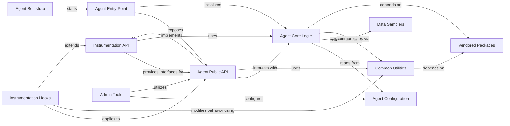

## Component Details

This graph illustrates the architecture of the New Relic Python Agent, focusing on its core components and their interactions. The main flow involves the Agent Entry Point initializing the Agent Core Logic and exposing the Agent Public API for application instrumentation. The Instrumentation API defines the foundational interfaces, which are implemented by the Agent Public API and extended by Instrumentation Hooks for specific integrations. The Agent Core Logic handles data aggregation, configuration, and communication, relying on Agent Configuration, Data Samplers, and Common Utilities. Common Utilities and Agent Core Logic also depend on Vendored Packages. Admin Tools provide utilities for configuration and interaction with the Agent Public API, while Agent Bootstrap ensures the initial setup of the agent.

### Instrumentation API
Provides the foundational interfaces and decorators for instrumenting various types of operations within an application, defining transactions, time traces (spans), and capturing errors. It serves as the base for all specific instrumentation modules.

**Related Classes/Methods**:

- `newrelic.api.transaction` (full file reference)
- `newrelic.api.time_trace` (full file reference)
- <a href="https://github.com/newrelic/newrelic-python-agent/blob/master/newrelic/api/function_trace.py#L165-L175" target="_blank" rel="noopener noreferrer">`newrelic.api.function_trace` (165:175)</a>
- <a href="https://github.com/newrelic/newrelic-python-agent/blob/master/newrelic/api/error_trace.py#L72-L78" target="_blank" rel="noopener noreferrer">`newrelic.api.error_trace` (72:78)</a>
- <a href="https://github.com/newrelic/newrelic-python-agent/blob/master/newrelic/api/background_task.py#L116-L117" target="_blank" rel="noopener noreferrer">`newrelic.api.background_task` (116:117)</a>
- <a href="https://github.com/newrelic/newrelic-python-agent/blob/master/newrelic/api/transaction_name.py#L72-L73" target="_blank" rel="noopener noreferrer">`newrelic.api.transaction_name` (72:73)</a>
- `newrelic.api.settings` (full file reference)
- `newrelic.api.supportability` (full file reference)
- `newrelic.api.llm_custom_attributes` (full file reference)

### Agent Entry Point
The primary module that serves as the public interface for initializing and interacting with the New Relic Python Agent, re-exporting key functionalities from other components.

**Related Classes/Methods**:

- `newrelic.agent` (full file reference)

### Agent Public API
This component provides the external interface for application instrumentation, including functionalities for managing transactions, tracing functions, handling errors, and recording custom events.

**Related Classes/Methods**:

- `newrelic.api.application` (full file reference)
- `newrelic.api.time_trace` (full file reference)
- `newrelic.api.transaction` (full file reference)
- <a href="https://github.com/newrelic/newrelic-python-agent/blob/master/newrelic/api/wsgi_application.py#L678-L686" target="_blank" rel="noopener noreferrer">`newrelic.api.wsgi_application` (678:686)</a>
- <a href="https://github.com/newrelic/newrelic-python-agent/blob/master/newrelic/api/asgi_application.py#L351-L359" target="_blank" rel="noopener noreferrer">`newrelic.api.asgi_application` (351:359)</a>
- <a href="https://github.com/newrelic/newrelic-python-agent/blob/master/newrelic/api/background_task.py#L116-L117" target="_blank" rel="noopener noreferrer">`newrelic.api.background_task` (116:117)</a>
- <a href="https://github.com/newrelic/newrelic-python-agent/blob/master/newrelic/api/database_trace.py#L261-L262" target="_blank" rel="noopener noreferrer">`newrelic.api.database_trace` (261:262)</a>
- <a href="https://github.com/newrelic/newrelic-python-agent/blob/master/newrelic/api/datastore_trace.py#L238-L285" target="_blank" rel="noopener noreferrer">`newrelic.api.datastore_trace` (238:285)</a>
- <a href="https://github.com/newrelic/newrelic-python-agent/blob/master/newrelic/api/error_trace.py#L72-L78" target="_blank" rel="noopener noreferrer">`newrelic.api.error_trace` (72:78)</a>
- <a href="https://github.com/newrelic/newrelic-python-agent/blob/master/newrelic/api/external_trace.py#L124-L125" target="_blank" rel="noopener noreferrer">`newrelic.api.external_trace` (124:125)</a>
- <a href="https://github.com/newrelic/newrelic-python-agent/blob/master/newrelic/api/function_trace.py#L165-L175" target="_blank" rel="noopener noreferrer">`newrelic.api.function_trace` (165:175)</a>
- <a href="https://github.com/newrelic/newrelic-python-agent/blob/master/newrelic/api/generator_trace.py#L128-L129" target="_blank" rel="noopener noreferrer">`newrelic.api.generator_trace` (128:129)</a>
- `newrelic.api.html_insertion` (full file reference)
- <a href="https://github.com/newrelic/newrelic-python-agent/blob/master/newrelic/api/lambda_handler.py#L164-L171" target="_blank" rel="noopener noreferrer">`newrelic.api.lambda_handler` (164:171)</a>
- `newrelic.api.llm_custom_attributes` (full file reference)
- `newrelic.api.log` (full file reference)
- <a href="https://github.com/newrelic/newrelic-python-agent/blob/master/newrelic/api/message_trace.py#L157-L172" target="_blank" rel="noopener noreferrer">`newrelic.api.message_trace` (157:172)</a>
- <a href="https://github.com/newrelic/newrelic-python-agent/blob/master/newrelic/api/message_transaction.py#L229-L253" target="_blank" rel="noopener noreferrer">`newrelic.api.message_transaction` (229:253)</a>
- `newrelic.api.ml_model` (full file reference)
- <a href="https://github.com/newrelic/newrelic-python-agent/blob/master/newrelic/api/profile_trace.py#L204-L205" target="_blank" rel="noopener noreferrer">`newrelic.api.profile_trace` (204:205)</a>
- `newrelic.api.settings` (full file reference)
- `newrelic.api.supportability` (full file reference)
- <a href="https://github.com/newrelic/newrelic-python-agent/blob/master/newrelic/api/transaction_name.py#L72-L73" target="_blank" rel="noopener noreferrer">`newrelic.api.transaction_name` (72:73)</a>
- <a href="https://github.com/newrelic/newrelic-python-agent/blob/master/newrelic/api/web_transaction.py#L931-L955" target="_blank" rel="noopener noreferrer">`newrelic.api.web_transaction` (931:955)</a>

### Agent Core Logic
This component encapsulates the fundamental logic of the New Relic agent, including data aggregation, configuration management, and communication with the New Relic collector.

**Related Classes/Methods**:

- `newrelic.core.agent` (full file reference)
- `newrelic.core.application` (full file reference)
- `newrelic.core.attribute` (full file reference)
- `newrelic.core.attribute_filter` (full file reference)
- `newrelic.core.code_level_metrics` (full file reference)
- `newrelic.core.context` (full file reference)
- `newrelic.core.custom_event` (full file reference)
- `newrelic.core.data_collector` (full file reference)
- `newrelic.core.database_node` (full file reference)
- `newrelic.core.database_utils` (full file reference)
- `newrelic.core.datastore_node` (full file reference)
- `newrelic.core.environment` (full file reference)
- `newrelic.core.error_collector` (full file reference)
- `newrelic.core.external_node` (full file reference)
- `newrelic.core.function_node` (full file reference)
- `newrelic.core.graphql_node` (full file reference)
- `newrelic.core.graphql_utils` (full file reference)
- `newrelic.core.infinite_tracing_pb2` (full file reference)
- `newrelic.core.internal_metrics` (full file reference)
- `newrelic.core.log_event_node` (full file reference)
- `newrelic.core.loop_node` (full file reference)
- `newrelic.core.memcache_node` (full file reference)
- `newrelic.core.message_node` (full file reference)
- `newrelic.core.metric` (full file reference)
- `newrelic.core.node_mixin` (full file reference)
- `newrelic.core.otlp_utils` (full file reference)
- `newrelic.core.profile_sessions` (full file reference)
- `newrelic.core.root_node` (full file reference)
- `newrelic.core.rules_engine` (full file reference)
- `newrelic.core.solr_node` (full file reference)
- `newrelic.core.stack_trace` (full file reference)
- `newrelic.core.stats_engine` (full file reference)
- `newrelic.core.string_table` (full file reference)
- `newrelic.core.thread_utilization` (full file reference)
- <a href="https://github.com/newrelic/newrelic-python-agent/blob/master/newrelic/core/trace_cache.py#L454-L455" target="_blank" rel="noopener noreferrer">`newrelic.core.trace_cache` (454:455)</a>
- `newrelic.core.transaction_node` (full file reference)

### Agent Configuration
This component is responsible for loading, parsing, and managing the configuration settings for the New Relic agent.

**Related Classes/Methods**:

- `newrelic.config` (full file reference)

### Common Utilities
This component provides a collection of general-purpose utility functions and classes used throughout the New Relic agent, such as object wrapping, naming conventions, encoding, and network-related utilities.

**Related Classes/Methods**:

- `newrelic.common.object_names` (full file reference)
- `newrelic.common.object_wrapper` (full file reference)
- `newrelic.common.agent_http` (full file reference)
- <a href="https://github.com/newrelic/newrelic-python-agent/blob/master/newrelic/common/async_proxy.py#L154-L161" target="_blank" rel="noopener noreferrer">`newrelic.common.async_proxy` (154:161)</a>
- <a href="https://github.com/newrelic/newrelic-python-agent/blob/master/newrelic/common/async_wrapper.py#L80-L89" target="_blank" rel="noopener noreferrer">`newrelic.common.async_wrapper` (80:89)</a>
- `newrelic.common.certs` (full file reference)
- `newrelic.common.coroutine` (full file reference)
- `newrelic.common.encoding_utils` (full file reference)
- `newrelic.common.log_file` (full file reference)
- `newrelic.common.metric_utils` (full file reference)
- `newrelic.common.package_version_utils` (full file reference)
- `newrelic.common.signature` (full file reference)
- `newrelic.common.streaming_utils` (full file reference)
- `newrelic.common.stopwatch` (full file reference)
- `newrelic.common.system_info` (full file reference)
- `newrelic.common.utilization` (full file reference)
- `newrelic.network.exceptions` (full file reference)

### Data Samplers
This component is responsible for collecting various system-level metrics and data points, such as CPU usage, garbage collection data, and memory usage.

**Related Classes/Methods**:

- `newrelic.samplers.decorators` (full file reference)
- `newrelic.samplers.cpu_usage` (full file reference)
- `newrelic.samplers.data_sampler` (full file reference)
- `newrelic.samplers.gc_data` (full file reference)
- `newrelic.samplers.memory_usage` (full file reference)

### Instrumentation Hooks
This component contains specific instrumentation for various third-party libraries and frameworks, allowing the agent to automatically collect data from them.

**Related Classes/Methods**:

- `newrelic.hooks.adapter_asgiref` (full file reference)
- `newrelic.hooks.adapter_cheroot` (full file reference)
- `newrelic.hooks.adapter_cherrypy` (full file reference)
- `newrelic.hooks.adapter_daphne` (full file reference)
- `newrelic.hooks.adapter_flup` (full file reference)
- `newrelic.hooks.adapter_gevent` (full file reference)
- `newrelic.hooks.adapter_gunicorn` (full file reference)
- `newrelic.hooks.adapter_hypercorn` (full file reference)
- `newrelic.hooks.adapter_mcp` (full file reference)
- `newrelic.hooks.adapter_meinheld` (full file reference)
- `newrelic.hooks.adapter_paste` (full file reference)
- `newrelic.hooks.adapter_uvicorn` (full file reference)
- `newrelic.hooks.adapter_waitress` (full file reference)
- `newrelic.hooks.adapter_wsgiref` (full file reference)
- `newrelic.hooks.application_celery` (full file reference)
- `newrelic.hooks.application_gearman` (full file reference)
- `newrelic.hooks.component_cornice` (full file reference)
- `newrelic.hooks.component_djangorestframework` (full file reference)
- `newrelic.hooks.component_flask_rest` (full file reference)
- `newrelic.hooks.component_graphqlserver` (full file reference)
- `newrelic.hooks.component_piston` (full file reference)
- `newrelic.hooks.component_sentry` (full file reference)
- `newrelic.hooks.component_tastypie` (full file reference)
- `newrelic.hooks.coroutines_asyncio` (full file reference)
- `newrelic.hooks.coroutines_gevent` (full file reference)
- `newrelic.hooks.database_aiomysql` (full file reference)
- `newrelic.hooks.database_asyncpg` (full file reference)
- `newrelic.hooks.database_cx_oracle` (full file reference)
- `newrelic.hooks.database_dbapi2` (full file reference)
- `newrelic.hooks.database_dbapi2_async` (full file reference)
- `newrelic.hooks.database_ibm_db_dbi` (full file reference)
- `newrelic.hooks.database_mysql` (full file reference)
- `newrelic.hooks.database_mysqldb` (full file reference)
- `newrelic.hooks.database_postgresql` (full file reference)
- `newrelic.hooks.database_psycopg` (full file reference)
- `newrelic.hooks.database_psycopg2` (full file reference)
- `newrelic.hooks.database_psycopg2cffi` (full file reference)
- `newrelic.hooks.database_psycopg2ct` (full file reference)
- `newrelic.hooks.database_pymssql` (full file reference)
- `newrelic.hooks.database_pymysql` (full file reference)
- `newrelic.hooks.database_pyodbc` (full file reference)
- `newrelic.hooks.database_sqlite` (full file reference)
- `newrelic.hooks.datastore_aiomcache` (full file reference)
- `newrelic.hooks.datastore_aioredis` (full file reference)
- `newrelic.hooks.datastore_aredis` (full file reference)
- `newrelic.hooks.datastore_bmemcached` (full file reference)
- `newrelic.hooks.datastore_cassandradriver` (full file reference)
- `newrelic.hooks.datastore_elasticsearch` (full file reference)
- `newrelic.hooks.datastore_firestore` (full file reference)
- `newrelic.hooks.datastore_memcache` (full file reference)
- `newrelic.hooks.datastore_motor` (full file reference)
- `newrelic.hooks.datastore_pyelasticsearch` (full file reference)
- `newrelic.hooks.datastore_pylibmc` (full file reference)
- `newrelic.hooks.datastore_pymemcache` (full file reference)
- `newrelic.hooks.datastore_pymongo` (full file reference)
- `newrelic.hooks.datastore_pysolr` (full file reference)
- `newrelic.hooks.datastore_redis` (full file reference)
- `newrelic.hooks.datastore_solrpy` (full file reference)
- `newrelic.hooks.datastore_valkey` (full file reference)
- `newrelic.hooks.external_aiobotocore` (full file reference)
- `newrelic.hooks.external_botocore` (full file reference)
- `newrelic.hooks.external_dropbox` (full file reference)
- `newrelic.hooks.external_facepy` (full file reference)
- `newrelic.hooks.external_feedparser` (full file reference)
- `newrelic.hooks.external_httplib` (full file reference)
- `newrelic.hooks.external_httplib2` (full file reference)
- `newrelic.hooks.external_httpx` (full file reference)
- `newrelic.hooks.external_requests` (full file reference)
- `newrelic.hooks.external_s3transfer` (full file reference)
- `newrelic.hooks.external_thrift` (full file reference)
- `newrelic.hooks.external_urllib` (full file reference)
- `newrelic.hooks.external_urllib3` (full file reference)
- `newrelic.hooks.external_xmlrpclib` (full file reference)
- `newrelic.hooks.framework_aiohttp` (full file reference)
- `newrelic.hooks.framework_ariadne` (full file reference)
- `newrelic.hooks.framework_bottle` (full file reference)
- `newrelic.hooks.framework_cherrypy` (full file reference)
- `newrelic.hooks.framework_django` (full file reference)
- `newrelic.hooks.framework_falcon` (full file reference)
- `newrelic.hooks.framework_fastapi` (full file reference)
- `newrelic.hooks.framework_flask` (full file reference)
- `newrelic.hooks.framework_graphene` (full file reference)
- `newrelic.hooks.framework_graphql` (full file reference)
- `newrelic.hooks.framework_graphql_py3` (full file reference)
- `newrelic.hooks.framework_grpc` (full file reference)
- `newrelic.hooks.framework_pyramid` (full file reference)
- `newrelic.hooks.framework_sanic` (full file reference)
- `newrelic.hooks.framework_starlette` (full file reference)
- `newrelic.hooks.framework_strawberry` (full file reference)
- `newrelic.hooks.framework_tornado` (full file reference)
- `newrelic.hooks.framework_webpy` (full file reference)
- `newrelic.hooks.logger_logging` (full file reference)
- `newrelic.hooks.logger_loguru` (full file reference)
- `newrelic.hooks.logger_structlog` (full file reference)
- `newrelic.hooks.memcache_memcache` (full file reference)
- `newrelic.hooks.messagebroker_confluentkafka` (full file reference)
- `newrelic.hooks.messagebroker_kafkapython` (full file reference)
- `newrelic.hooks.messagebroker_kombu` (full file reference)
- `newrelic.hooks.messagebroker_pika` (full file reference)
- `newrelic.hooks.middleware_flask_compress` (full file reference)
- `newrelic.hooks.mlmodel_gemini` (full file reference)
- `newrelic.hooks.mlmodel_langchain` (full file reference)
- `newrelic.hooks.mlmodel_openai` (full file reference)
- `newrelic.hooks.mlmodel_sklearn` (full file reference)
- `newrelic.hooks.template_genshi` (full file reference)
- `newrelic.hooks.template_jinja2` (full file reference)
- `newrelic.hooks.template_mako` (full file reference)

### Admin Tools
This component provides administrative utilities for the New Relic agent, such as generating configuration files, deploying records, and debugging.

**Related Classes/Methods**:

- `newrelic.admin.__main__` (full file reference)
- <a href="https://github.com/newrelic/newrelic-python-agent/blob/master/newrelic/admin/debug_console.py#L26-L42" target="_blank" rel="noopener noreferrer">`newrelic.admin.debug_console` (26:42)</a>
- <a href="https://github.com/newrelic/newrelic-python-agent/blob/master/newrelic/admin/generate_config.py#L21-L46" target="_blank" rel="noopener noreferrer">`newrelic.admin.generate_config` (21:46)</a>
- <a href="https://github.com/newrelic/newrelic-python-agent/blob/master/newrelic/admin/license_key.py#L25-L59" target="_blank" rel="noopener noreferrer">`newrelic.admin.license_key` (25:59)</a>
- <a href="https://github.com/newrelic/newrelic-python-agent/blob/master/newrelic/admin/local_config.py#L24-L57" target="_blank" rel="noopener noreferrer">`newrelic.admin.local_config` (24:57)</a>
- <a href="https://github.com/newrelic/newrelic-python-agent/blob/master/newrelic/admin/network_config.py#L24-L64" target="_blank" rel="noopener noreferrer">`newrelic.admin.network_config` (24:64)</a>
- <a href="https://github.com/newrelic/newrelic-python-agent/blob/master/newrelic/admin/record_deploy.py#L41-L102" target="_blank" rel="noopener noreferrer">`newrelic.admin.record_deploy` (41:102)</a>
- <a href="https://github.com/newrelic/newrelic-python-agent/blob/master/newrelic/admin/run_program.py#L30-L110" target="_blank" rel="noopener noreferrer">`newrelic.admin.run_program` (30:110)</a>
- <a href="https://github.com/newrelic/newrelic-python-agent/blob/master/newrelic/admin/run_python.py#L30-L107" target="_blank" rel="noopener noreferrer">`newrelic.admin.run_python` (30:107)</a>
- <a href="https://github.com/newrelic/newrelic-python-agent/blob/master/newrelic/admin/server_config.py#L26-L78" target="_blank" rel="noopener noreferrer">`newrelic.admin.server_config` (26:78)</a>
- <a href="https://github.com/newrelic/newrelic-python-agent/blob/master/newrelic/admin/validate_config.py#L139-L233" target="_blank" rel="noopener noreferrer">`newrelic.admin.validate_config` (139:233)</a>

### Vendored Packages
This component includes vendored or repackaged third-party libraries that the New Relic agent depends on for various functionalities.

**Related Classes/Methods**:

- `newrelic.packages.asgiref_compatibility` (full file reference)
- `newrelic.packages.isort` (full file reference)
- `newrelic.packages.isort.stdlibs` (full file reference)
- `newrelic.packages.opentelemetry_proto.common_pb2` (full file reference)
- `newrelic.packages.opentelemetry_proto.logs_pb2` (full file reference)
- `newrelic.packages.opentelemetry_proto.metrics_pb2` (full file reference)
- `newrelic.packages.opentelemetry_proto.resource_pb2` (full file reference)
- `newrelic.packages.urllib3` (full file reference)
- `newrelic.packages.urllib3._collections` (full file reference)
- `newrelic.packages.urllib3._version` (full file reference)
- `newrelic.packages.urllib3.connection` (full file reference)
- `newrelic.packages.urllib3.connectionpool` (full file reference)
- `newrelic.packages.urllib3.contrib._securetransport.bindings` (full file reference)
- `newrelic.packages.urllib3.contrib._securetransport.low_level` (full file reference)
- `newrelic.packages.urllib3.contrib.securetransport` (full file reference)
- `newrelic.packages.urllib3.exceptions` (full file reference)
- `newrelic.packages.urllib3.fields` (full file reference)
- `newrelic.packages.urllib3.filepost` (full file reference)
- `newrelic.packages.urllib3.packages` (full file reference)
- `newrelic.packages.urllib3.packages.six` (full file reference)
- `newrelic.packages.urllib3.poolmanager` (full file reference)
- `newrelic.packages.urllib3.request` (full file reference)
- `newrelic.packages.urllib3.response` (full file reference)
- `newrelic.packages.urllib3.util` (full file reference)
- `newrelic.packages.urllib3.util.connection` (full file reference)
- `newrelic.packages.urllib3.util.proxy` (full file reference)
- `newrelic.packages.urllib3.util.queue` (full file reference)
- `newrelic.packages.urllib3.util.request` (full file reference)
- `newrelic.packages.urllib3.util.response` (full file reference)
- `newrelic.packages.urllib3.util.retry` (full file reference)
- `newrelic.packages.urllib3.util.ssl_` (full file reference)
- `newrelic.packages.urllib3.util.ssl_match_hostname` (full file reference)
- `newrelic.packages.urllib3.util.timeout` (full file reference)
- `newrelic.packages.urllib3.util.url` (full file reference)
- `newrelic.packages.urllib3.util.wait` (full file reference)
- `newrelic.packages.wrapt` (full file reference)
- `newrelic.packages.wrapt.__wrapt__` (full file reference)
- `newrelic.packages.wrapt.arguments` (full file reference)
- `newrelic.packages.wrapt.decorators` (full file reference)
- `newrelic.packages.wrapt.importer` (full file reference)
- `newrelic.packages.wrapt.patches` (full file reference)
- `newrelic.packages.wrapt.weakrefs` (full file reference)

### Agent Bootstrap
This component handles the initial setup and bootstrapping of the agent, ensuring it is properly initialized before application code runs.

**Related Classes/Methods**:

- `newrelic.bootstrap.sitecustomize` (full file reference)

### [FAQ](https://github.com/CodeBoarding/GeneratedOnBoardings/tree/main?tab=readme-ov-file#faq)