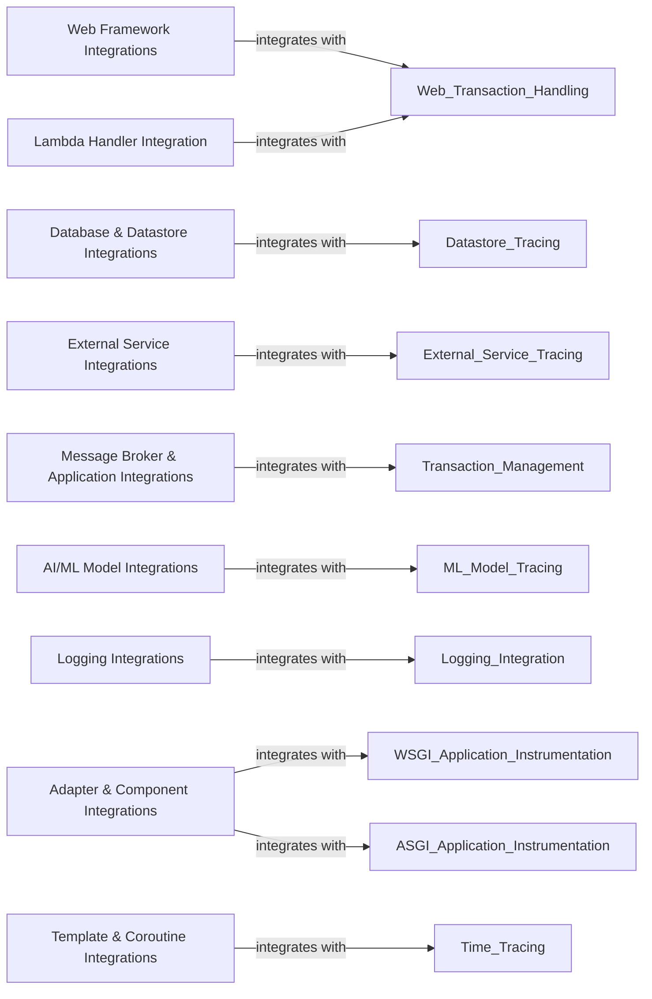

## Component Details

The 'Specific Integrations & Hooks' subsystem provides comprehensive instrumentation for various web frameworks, database clients, external services, message queuing systems, AI/ML models, logging frameworks, and other specific components. It ensures proper transaction capturing and context propagation across diverse application environments. This is achieved through a modular design, where each abstract component focuses on a specific integration area, utilizing New Relic's API modules for core tracing functionalities and a wide array of hooks for specific third-party libraries and frameworks.

### Web Framework Integrations
Provides instrumentation for various web frameworks to capture web transactions, including request and response details, and integrate with the agent's transaction management.

**Related Classes/Methods**:

- <a href="https://github.com/newrelic/newrelic-python-agent/blob/master/newrelic/api/web_transaction.py#L931-L955" target="_blank" rel="noopener noreferrer">`newrelic-python-agent.newrelic.api.web_transaction` (931:955)</a>
- <a href="https://github.com/newrelic/newrelic-python-agent/blob/master/newrelic/api/wsgi_application.py#L678-L686" target="_blank" rel="noopener noreferrer">`newrelic-python-agent.newrelic.api.wsgi_application` (678:686)</a>
- <a href="https://github.com/newrelic/newrelic-python-agent/blob/master/newrelic/api/asgi_application.py#L351-L359" target="_blank" rel="noopener noreferrer">`newrelic-python-agent.newrelic.api.asgi_application` (351:359)</a>
- `newrelic-python-agent.newrelic.api.html_insertion` (full file reference)
- `newrelic-python-agent.newrelic.hooks.framework_django` (full file reference)
- `newrelic-python-agent.newrelic.hooks.framework_flask` (full file reference)
- `newrelic-python-agent.newrelic.hooks.framework_tornado` (full file reference)
- `newrelic-python-agent.newrelic.hooks.framework_pyramid` (full file reference)
- `newrelic-python-agent.newrelic.hooks.framework_falcon` (full file reference)
- `newrelic-python-agent.newrelic.hooks.framework_sanic` (full file reference)
- `newrelic-python-agent.newrelic.hooks.framework_starlette` (full file reference)
- `newrelic-python-agent.newrelic.hooks.framework_bottle` (full file reference)
- `newrelic-python-agent.newrelic.hooks.framework_aiohttp` (full file reference)
- `newrelic-python-agent.newrelic.hooks.framework_fastapi` (full file reference)
- `newrelic-python-agent.newrelic.hooks.framework_grpc` (full file reference)
- `newrelic-python-agent.newrelic.hooks.framework_graphene` (full file reference)
- `newrelic-python-agent.newrelic.hooks.framework_graphql` (full file reference)
- `newrelic-python-agent.newrelic.hooks.framework_graphql_py3` (full file reference)
- `newrelic-python-agent.newrelic.hooks.framework_webpy` (full file reference)

### Database & Datastore Integrations
Provides instrumentation for various database clients and datastore systems (e.g., Redis, Elasticsearch, Memcache) to trace operations and capture performance metrics.

**Related Classes/Methods**:

- <a href="https://github.com/newrelic/newrelic-python-agent/blob/master/newrelic/api/datastore_trace.py#L238-L285" target="_blank" rel="noopener noreferrer">`newrelic-python-agent.newrelic.api.datastore_trace` (238:285)</a>
- <a href="https://github.com/newrelic/newrelic-python-agent/blob/master/newrelic/api/database_trace.py#L261-L262" target="_blank" rel="noopener noreferrer">`newrelic-python-agent.newrelic.api.database_trace` (261:262)</a>
- <a href="https://github.com/newrelic/newrelic-python-agent/blob/master/newrelic/api/memcache_trace.py#L83-L84" target="_blank" rel="noopener noreferrer">`newrelic-python-agent.newrelic.api.memcache_trace` (83:84)</a>
- <a href="https://github.com/newrelic/newrelic-python-agent/blob/master/newrelic/api/solr_trace.py#L103-L107" target="_blank" rel="noopener noreferrer">`newrelic-python-agent.newrelic.api.solr_trace` (103:107)</a>
- `newrelic-python-agent.newrelic.hooks.database_mysqldb` (full file reference)
- `newrelic-python-agent.newrelic.hooks.database_psycopg` (full file reference)
- `newrelic-python-agent.newrelic.hooks.datastore_redis` (full file reference)
- `newrelic-python-agent.newrelic.hooks.datastore_elasticsearch` (full file reference)
- `newrelic-python-agent.newrelic.hooks.database_aiomysql` (full file reference)
- `newrelic-python-agent.newrelic.hooks.database_asyncpg` (full file reference)
- `newrelic-python-agent.newrelic.hooks.database_cx_oracle` (full file reference)
- `newrelic-python-agent.newrelic.hooks.database_dbapi2` (full file reference)
- `newrelic-python-agent.newrelic.hooks.database_ibm_db_dbi` (full file reference)
- `newrelic-python-agent.newrelic.hooks.database_mysql` (full file reference)
- `newrelic-python-agent.newrelic.hooks.database_postgresql` (full file reference)
- `newrelic-python-agent.newrelic.hooks.database_psycopg2` (full file reference)
- `newrelic-python-agent.newrelic.hooks.database_pymssql` (full file reference)
- `newrelic-python-agent.newrelic.hooks.database_pymysql` (full file reference)
- `newrelic-python-agent.newrelic.hooks.database_sqlite` (full file reference)
- `newrelic-python-agent.newrelic.hooks.datastore_aiomcache` (full file reference)
- `newrelic-python-agent.newrelic.hooks.datastore_aioredis` (full file reference)
- `newrelic-python-agent.newrelic.hooks.datastore_aredis` (full file reference)
- `newrelic-python-agent.newrelic.hooks.datastore_bmemcached` (full file reference)
- `newrelic-python-agent.newrelic.hooks.datastore_cassandradriver` (full file reference)
- `newrelic-python-agent.newrelic.hooks.datastore_firestore` (full file reference)
- `newrelic-python-agent.newrelic.hooks.datastore_memcache` (full file reference)
- `newrelic-python-agent.newrelic.hooks.datastore_motor` (full file reference)
- `newrelic-python-agent.newrelic.hooks.datastore_pyelasticsearch` (full file reference)
- `newrelic-python-agent.newrelic.hooks.datastore_pylibmc` (full file reference)
- `newrelic-python-agent.newrelic.hooks.datastore_pymemcache` (full file reference)
- `newrelic-python-agent.newrelic.hooks.datastore_pymongo` (full file reference)
- `newrelic-python-agent.newrelic.hooks.datastore_pysolr` (full file reference)
- `newrelic-python-agent.newrelic.hooks.datastore_solrpy` (full file reference)
- `newrelic-python-agent.newrelic.hooks.datastore_valkey` (full file reference)

### External Service Integrations
Provides instrumentation for calls to external services, capturing details of outbound requests and responses for distributed tracing.

**Related Classes/Methods**:

- <a href="https://github.com/newrelic/newrelic-python-agent/blob/master/newrelic/api/external_trace.py#L124-L125" target="_blank" rel="noopener noreferrer">`newrelic-python-agent.newrelic.api.external_trace` (124:125)</a>
- `newrelic-python-agent.newrelic.hooks.external_requests` (full file reference)
- `newrelic-python-agent.newrelic.hooks.external_urllib3` (full file reference)
- `newrelic-python-agent.newrelic.hooks.external_botocore` (full file reference)
- `newrelic-python-agent.newrelic.hooks.external_httpx` (full file reference)
- `newrelic-python-agent.newrelic.hooks.external_aiobotocore` (full file reference)
- `newrelic-python-agent.newrelic.hooks.external_dropbox` (full file reference)
- `newrelic-python-agent.newrelic.hooks.external_facepy` (full file reference)
- `newrelic-python-agent.newrelic.hooks.external_feedparser` (full file reference)
- `newrelic-python-agent.newrelic.hooks.external_httplib` (full file reference)
- `newrelic-python-agent.newrelic.hooks.external_httplib2` (full file reference)
- `newrelic-python-agent.newrelic.hooks.external_s3transfer` (full file reference)
- `newrelic-python-agent.newrelic.hooks.external_thrift` (full file reference)
- `newrelic-python-agent.newrelic.hooks.external_urllib` (full file reference)
- `newrelic-python-agent.newrelic.hooks.external_xmlrpclib` (full file reference)

### Message Broker & Application Integrations
Provides instrumentation for message queuing systems and other application-level components to trace message production and consumption, and background tasks.

**Related Classes/Methods**:

- <a href="https://github.com/newrelic/newrelic-python-agent/blob/master/newrelic/api/message_trace.py#L157-L172" target="_blank" rel="noopener noreferrer">`newrelic-python-agent.newrelic.api.message_trace` (157:172)</a>
- <a href="https://github.com/newrelic/newrelic-python-agent/blob/master/newrelic/api/message_transaction.py#L229-L253" target="_blank" rel="noopener noreferrer">`newrelic-python-agent.newrelic.api.message_transaction` (229:253)</a>
- `newrelic-python-agent.newrelic.hooks.application_celery` (full file reference)
- `newrelic-python-agent.newrelic.hooks.messagebroker_kombu` (full file reference)
- `newrelic-python-agent.newrelic.hooks.messagebroker_kafkapython` (full file reference)
- `newrelic-python-agent.newrelic.hooks.messagebroker_pika` (full file reference)
- `newrelic-python-agent.newrelic.hooks.application_gearman` (full file reference)
- `newrelic-python-agent.newrelic.hooks.messagebroker_confluentkafka` (full file reference)

### AI/ML Model Integrations
Provides instrumentation for AI/ML models and related frameworks to capture model inference and training details, and integrate with LLM observability.

**Related Classes/Methods**:

- `newrelic-python-agent.newrelic.api.ml_model` (full file reference)
- `newrelic-python-agent.newrelic.hooks.mlmodel_langchain` (full file reference)
- `newrelic-python-agent.newrelic.hooks.mlmodel_openai` (full file reference)
- `newrelic-python-agent.newrelic.hooks.mlmodel_gemini` (full file reference)
- `newrelic-python-agent.newrelic.hooks.mlmodel_sklearn` (full file reference)

### Logging Integrations
Provides integration with various logging frameworks to capture and forward log events, enriching them with New Relic linking metadata.

**Related Classes/Methods**:

- `newrelic-python-agent.newrelic.api.log` (full file reference)
- `newrelic-python-agent.newrelic.hooks.logger_logging` (full file reference)
- `newrelic-python-agent.newrelic.hooks.logger_loguru` (full file reference)
- `newrelic-python-agent.newrelic.hooks.logger_structlog` (full file reference)

### Adapter & Component Integrations
Provides instrumentation for various adapters (e.g., WSGI, ASGI servers) and specific components (e.g., Django REST Framework, GraphQL Server) to ensure proper transaction capturing and context propagation.

**Related Classes/Methods**:

- `newrelic-python-agent.newrelic.hooks.adapter_asgiref` (full file reference)
- `newrelic-python-agent.newrelic.hooks.adapter_cheroot` (full file reference)
- `newrelic-python-agent.newrelic.hooks.adapter_cherrypy` (full file reference)
- `newrelic-python-agent.newrelic.hooks.adapter_daphne` (full file reference)
- `newrelic-python-agent.newrelic.hooks.adapter_flup` (full file reference)
- `newrelic-python-agent.newrelic.hooks.adapter_gevent` (full file reference)
- `newrelic-python-agent.newrelic.hooks.adapter_gunicorn` (full file reference)
- `newrelic-python-agent.newrelic.hooks.adapter_hypercorn` (full file reference)
- `newrelic-python-agent.newrelic.hooks.adapter_mcp` (full file reference)
- `newrelic-python-agent.newrelic.hooks.adapter_meinheld` (full file reference)
- `newrelic-python-agent.newrelic.hooks.adapter_paste` (full file reference)
- `newrelic-python-agent.newrelic.hooks.adapter_uvicorn` (full file reference)
- `newrelic-python-agent.newrelic.hooks.adapter_waitress` (full file reference)
- `newrelic-python-agent.newrelic.hooks.adapter_wsgiref` (full file reference)
- `newrelic-python-agent.newrelic.hooks.component_cornice` (full file reference)
- `newrelic-python-agent.newrelic.hooks.component_djangorestframework` (full file reference)
- `newrelic-python-agent.newrelic.hooks.component_flask_rest` (full file reference)
- `newrelic-python-agent.newrelic.hooks.component_graphqlserver` (full file reference)
- `newrelic-python-agent.newrelic.hooks.component_piston` (full file reference)
- `newrelic-python-agent.newrelic.hooks.component_sentry` (full file reference)
- `newrelic-python-agent.newrelic.hooks.component_tastypie` (full file reference)

### Template & Coroutine Integrations
Provides instrumentation for templating engines and asynchronous coroutine libraries to capture rendering times and ensure proper context propagation in asynchronous flows.

**Related Classes/Methods**:

- `newrelic-python-agent.newrelic.hooks.template_genshi` (full file reference)
- `newrelic-python-agent.newrelic.hooks.template_jinja2` (full file reference)
- `newrelic-python-agent.newrelic.hooks.template_mako` (full file reference)
- `newrelic-python-agent.newrelic.hooks.coroutines_asyncio` (full file reference)
- `newrelic-python-agent.newrelic.hooks.coroutines_gevent` (full file reference)

### Lambda Handler Integration
Provides specific instrumentation for AWS Lambda handlers to capture transaction details in a serverless environment.

**Related Classes/Methods**:

- <a href="https://github.com/newrelic/newrelic-python-agent/blob/master/newrelic/api/lambda_handler.py#L164-L171" target="_blank" rel="noopener noreferrer">`newrelic-python-agent.newrelic.api.lambda_handler` (164:171)</a>

### [FAQ](https://github.com/CodeBoarding/GeneratedOnBoardings/tree/main?tab=readme-ov-file#faq)