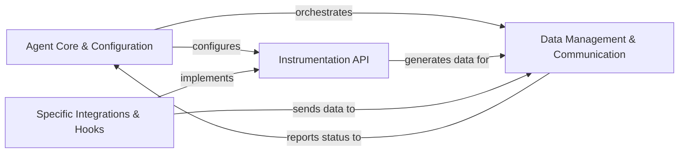

## Component Details

The New Relic Python Agent is designed to monitor Python applications, collecting performance metrics, traces, and events, and sending them to the New Relic platform for analysis. The core functionality revolves around instrumenting various aspects of an application's execution, managing the collected data, and securely communicating with the New Relic backend. The agent's architecture is modular, allowing for flexible integration with diverse frameworks and libraries while maintaining a centralized control and data processing mechanism.

### Agent Core & Configuration
Manages the overall lifecycle of the New Relic agent, including initialization, configuration loading, application activation, and shutdown. It also provides administrative utilities for agent management.

**Related Classes/Methods**:

- `newrelic-python-agent.newrelic.core.agent` (full file reference)
- `newrelic-python-agent.newrelic.core.config` (full file reference)
- `newrelic-python-agent.newrelic.admin` (full file reference)
- `newrelic-python-agent.newrelic.console` (full file reference)
- `newrelic-python-agent.setup` (full file reference)

### Instrumentation API
Provides the foundational interfaces and decorators for instrumenting various types of operations within an application, defining transactions, time traces (spans), and capturing errors. It serves as the base for all specific instrumentation modules.

**Related Classes/Methods**:

- `newrelic-python-agent.newrelic.api.transaction` (full file reference)
- `newrelic-python-agent.newrelic.api.time_trace` (full file reference)
- <a href="https://github.com/newrelic/newrelic-python-agent/blob/master/newrelic/api/function_trace.py#L165-L175" target="_blank" rel="noopener noreferrer">`newrelic-python-agent.newrelic.api.function_trace` (165:175)</a>
- <a href="https://github.com/newrelic/newrelic-python-agent/blob/master/newrelic/api/error_trace.py#L72-L78" target="_blank" rel="noopener noreferrer">`newrelic-python-agent.newrelic.api.error_trace` (72:78)</a>
- <a href="https://github.com/newrelic/newrelic-python-agent/blob/master/newrelic/api/background_task.py#L116-L117" target="_blank" rel="noopener noreferrer">`newrelic-python-agent.newrelic.api.background_task` (116:117)</a>
- <a href="https://github.com/newrelic/newrelic-python-agent/blob/master/newrelic/api/transaction_name.py#L72-L73" target="_blank" rel="noopener noreferrer">`newrelic-python-agent.newrelic.api.transaction_name` (72:73)</a>
- `newrelic-python-agent.newrelic.api.settings` (full file reference)
- `newrelic-python-agent.newrelic.api.supportability` (full file reference)
- `newrelic-python-agent.newrelic.api.llm_custom_attributes` (full file reference)

### Data Management & Communication
Responsible for the aggregation, sampling, and management of various metrics and events collected by the agent. It handles trace and span management, including context propagation, provides common data transformation utilities, and manages secure communication with the New Relic data collector for data export.

**Related Classes/Methods**:

- `newrelic-python-agent.newrelic.core.application` (full file reference)
- `newrelic-python-agent.newrelic.core.stats_engine` (full file reference)
- `newrelic-python-agent.newrelic.core.custom_event` (full file reference)
- `newrelic-python-agent.newrelic.core.error_collector` (full file reference)
- `newrelic-python-agent.newrelic.core.log_event_node` (full file reference)
- `newrelic-python-agent.newrelic.core.metric` (full file reference)
- <a href="https://github.com/newrelic/newrelic-python-agent/blob/master/newrelic/core/trace_cache.py#L454-L455" target="_blank" rel="noopener noreferrer">`newrelic-python-agent.newrelic.core.trace_cache` (454:455)</a>
- `newrelic-python-agent.newrelic.core.root_node` (full file reference)
- `newrelic-python-agent.newrelic.core.function_node` (full file reference)
- `newrelic-python-agent.newrelic.core.transaction_node` (full file reference)
- `newrelic-python-agent.newrelic.core.context` (full file reference)
- `newrelic-python-agent.newrelic.core.database_node` (full file reference)
- `newrelic-python-agent.newrelic.core.datastore_node` (full file reference)
- `newrelic-python-agent.newrelic.core.external_node` (full file reference)
- `newrelic-python-agent.newrelic.core.graphql_node` (full file reference)
- `newrelic-python-agent.newrelic.core.memcache_node` (full file reference)
- `newrelic-python-agent.newrelic.core.message_node` (full file reference)
- `newrelic-python-agent.newrelic.core.solr_node` (full file reference)
- `newrelic-python-agent.newrelic.core.loop_node` (full file reference)
- `newrelic-python-agent.newrelic.core.thread_utilization` (full file reference)
- `newrelic-python-agent.newrelic.common.encoding_utils` (full file reference)
- `newrelic-python-agent.newrelic.common.object_wrapper` (full file reference)
- `newrelic-python-agent.newrelic.common.object_names` (full file reference)
- `newrelic-python-agent.newrelic.common.system_info` (full file reference)
- `newrelic-python-agent.newrelic.common.utilization` (full file reference)
- <a href="https://github.com/newrelic/newrelic-python-agent/blob/master/newrelic/common/async_proxy.py#L154-L161" target="_blank" rel="noopener noreferrer">`newrelic-python-agent.newrelic.common.async_proxy` (154:161)</a>
- <a href="https://github.com/newrelic/newrelic-python-agent/blob/master/newrelic/common/async_wrapper.py#L80-L89" target="_blank" rel="noopener noreferrer">`newrelic-python-agent.newrelic.common.async_wrapper` (80:89)</a>
- `newrelic-python-agent.newrelic.common.coroutine` (full file reference)
- `newrelic-python-agent.newrelic.common.metric_utils` (full file reference)
- `newrelic-python-agent.newrelic.common.package_version_utils` (full file reference)
- `newrelic-python-agent.newrelic.common.signature` (full file reference)
- `newrelic-python-agent.newrelic.common.streaming_utils` (full file reference)
- `newrelic-python-agent.newrelic.core.attribute` (full file reference)
- `newrelic-python-agent.newrelic.core.database_utils` (full file reference)
- `newrelic-python-agent.newrelic.core.graphql_utils` (full file reference)
- `newrelic-python-agent.newrelic.core.code_level_metrics` (full file reference)
- `newrelic-python-agent.newrelic.core.stack_trace` (full file reference)
- `newrelic-python-agent.newrelic.core.string_table` (full file reference)
- `newrelic-python-agent.newrelic.core.otlp_utils` (full file reference)
- `newrelic-python-agent.newrelic.common.agent_http` (full file reference)
- `newrelic-python-agent.newrelic.core.agent_protocol` (full file reference)
- `newrelic-python-agent.newrelic.core.agent_streaming` (full file reference)
- `newrelic-python-agent.newrelic.core.data_collector` (full file reference)

### Specific Integrations & Hooks
Provides comprehensive instrumentation for various web frameworks, database clients, external services, message queuing systems, AI/ML models, logging frameworks, and other specific components. It ensures proper transaction capturing and context propagation across diverse application environments.

**Related Classes/Methods**:

- <a href="https://github.com/newrelic/newrelic-python-agent/blob/master/newrelic/api/web_transaction.py#L931-L955" target="_blank" rel="noopener noreferrer">`newrelic-python-agent.newrelic.api.web_transaction` (931:955)</a>
- <a href="https://github.com/newrelic/newrelic-python-agent/blob/master/newrelic/api/wsgi_application.py#L678-L686" target="_blank" rel="noopener noreferrer">`newrelic-python-agent.newrelic.api.wsgi_application` (678:686)</a>
- <a href="https://github.com/newrelic/newrelic-python-agent/blob/master/newrelic/api/asgi_application.py#L351-L359" target="_blank" rel="noopener noreferrer">`newrelic-python-agent.newrelic.api.asgi_application` (351:359)</a>
- `newrelic-python-agent.newrelic.api.html_insertion` (full file reference)
- <a href="https://github.com/newrelic/newrelic-python-agent/blob/master/newrelic/api/lambda_handler.py#L164-L171" target="_blank" rel="noopener noreferrer">`newrelic-python-agent.newrelic.api.lambda_handler` (164:171)</a>
- <a href="https://github.com/newrelic/newrelic-python-agent/blob/master/newrelic/api/datastore_trace.py#L238-L285" target="_blank" rel="noopener noreferrer">`newrelic-python-agent.newrelic.api.datastore_trace` (238:285)</a>
- <a href="https://github.com/newrelic/newrelic-python-agent/blob/master/newrelic/api/database_trace.py#L261-L262" target="_blank" rel="noopener noreferrer">`newrelic-python-agent.newrelic.api.database_trace` (261:262)</a>
- <a href="https://github.com/newrelic/newrelic-python-agent/blob/master/newrelic/api/external_trace.py#L124-L125" target="_blank" rel="noopener noreferrer">`newrelic-python-agent.newrelic.api.external_trace` (124:125)</a>
- <a href="https://github.com/newrelic/newrelic-python-agent/blob/master/newrelic/api/memcache_trace.py#L83-L84" target="_blank" rel="noopener noreferrer">`newrelic-python-agent.newrelic.api.memcache_trace` (83:84)</a>
- <a href="https://github.com/newrelic/newrelic-python-agent/blob/master/newrelic/api/solr_trace.py#L103-L107" target="_blank" rel="noopener noreferrer">`newrelic-python-agent.newrelic.api.solr_trace` (103:107)</a>
- <a href="https://github.com/newrelic/newrelic-python-agent/blob/master/newrelic/api/message_trace.py#L157-L172" target="_blank" rel="noopener noreferrer">`newrelic-python-agent.newrelic.api.message_trace` (157:172)</a>
- <a href="https://github.com/newrelic/newrelic-python-agent/blob/master/newrelic/api/message_transaction.py#L229-L253" target="_blank" rel="noopener noreferrer">`newrelic-python-agent.newrelic.api.message_transaction` (229:253)</a>
- `newrelic-python-agent.newrelic.api.graphql_trace` (full file reference)
- `newrelic-python-agent.newrelic.api.ml_model` (full file reference)
- `newrelic-python-agent.newrelic.api.log` (full file reference)
- `newrelic-python-agent.newrelic.hooks.framework_django` (full file reference)
- `newrelic-python-agent.newrelic.hooks.framework_flask` (full file reference)
- `newrelic-python-agent.newrelic.hooks.framework_tornado` (full file reference)
- `newrelic-python-agent.newrelic.hooks.framework_pyramid` (full file reference)
- `newrelic-python-agent.newrelic.hooks.framework_falcon` (full file reference)
- `newrelic-python-agent.newrelic.hooks.framework_sanic` (full file reference)
- `newrelic-python-agent.newrelic.hooks.framework_starlette` (full file reference)
- `newrelic-python-agent.newrelic.hooks.framework_bottle` (full file reference)
- `newrelic-python-agent.newrelic.hooks.framework_aiohttp` (full file reference)
- `newrelic-python-agent.newrelic.hooks.framework_fastapi` (full file reference)
- `newrelic-python-agent.newrelic.hooks.framework_grpc` (full file reference)
- `newrelic-python-agent.newrelic.hooks.framework_graphene` (full file reference)
- `newrelic-python-agent.newrelic.hooks.framework_graphql` (full file reference)
- `newrelic-python-agent.newrelic.hooks.framework_graphql_py3` (full file reference)
- `newrelic-python-agent.newrelic.hooks.framework_webpy` (full file reference)
- `newrelic-python-agent.newrelic.hooks.database_mysqldb` (full file reference)
- `newrelic-python-agent.newrelic.hooks.database_psycopg` (full file reference)
- `newrelic-python-agent.newrelic.hooks.datastore_redis` (full file reference)
- `newrelic-python-agent.newrelic.hooks.datastore_elasticsearch` (full file reference)
- `newrelic-python-agent.newrelic.hooks.database_aiomysql` (full file reference)
- `newrelic-python-agent.newrelic.hooks.database_asyncpg` (full file reference)
- `newrelic-python-agent.newrelic.hooks.database_cx_oracle` (full file reference)
- `newrelic-python-agent.newrelic.hooks.database_dbapi2` (full file reference)
- `newrelic-python-agent.newrelic.hooks.database_ibm_db_dbi` (full file reference)
- `newrelic-python-agent.newrelic.hooks.database_mysql` (full file reference)
- `newrelic-python-agent.newrelic.hooks.database_postgresql` (full file reference)
- `newrelic-python-agent.newrelic.hooks.database_psycopg2` (full file reference)
- `newrelic-python-agent.newrelic.hooks.database_pymssql` (full file reference)
- `newrelic-python-agent.newrelic.hooks.database_pymysql` (full file reference)
- `newrelic-python-agent.newrelic.hooks.database_sqlite` (full file reference)
- `newrelic-python-agent.newrelic.hooks.datastore_aiomcache` (full file reference)
- `newrelic-python-agent.newrelic.hooks.datastore_aioredis` (full file reference)
- `newrelic-python-agent.newrelic.hooks.datastore_aredis` (full file reference)
- `newrelic-python-agent.newrelic.hooks.datastore_bmemcached` (full file reference)
- `newrelic-python-agent.newrelic.hooks.datastore_cassandradriver` (full file reference)
- `newrelic-python-agent.newrelic.hooks.datastore_firestore` (full file reference)
- `newrelic-python-agent.newrelic.hooks.datastore_memcache` (full file reference)
- `newrelic-python-agent.newrelic.hooks.datastore_motor` (full file reference)
- `newrelic-python-agent.newrelic.hooks.datastore_pyelasticsearch` (full file reference)
- `newrelic-python-agent.newrelic.hooks.datastore_pylibmc` (full file reference)
- `newrelic-python-agent.newrelic.hooks.datastore_pymemcache` (full file reference)
- `newrelic-python-agent.newrelic.hooks.datastore_pymongo` (full file reference)
- `newrelic-python-agent.newrelic.hooks.datastore_pysolr` (full file reference)
- `newrelic-python-agent.newrelic.hooks.datastore_solrpy` (full file reference)
- `newrelic-python-agent.newrelic.hooks.datastore_valkey` (full file reference)
- `newrelic-python-agent.newrelic.hooks.external_requests` (full file reference)
- `newrelic-python-agent.newrelic.hooks.external_urllib3` (full file reference)
- `newrelic-python-agent.newrelic.hooks.external_botocore` (full file reference)
- `newrelic-python-agent.newrelic.hooks.external_httpx` (full file reference)
- `newrelic-python-agent.newrelic.hooks.external_aiobotocore` (full file reference)
- `newrelic-python-agent.newrelic.hooks.external_dropbox` (full file reference)
- `newrelic-python-agent.newrelic.hooks.external_facepy` (full file reference)
- `newrelic-python-agent.newrelic.hooks.external_feedparser` (full file reference)
- `newrelic-python-agent.newrelic.hooks.external_httplib` (full file reference)
- `newrelic-python-agent.newrelic.hooks.external_httplib2` (full file reference)
- `newrelic-python-agent.newrelic.hooks.external_s3transfer` (full file reference)
- `newrelic-python-agent.newrelic.hooks.external_thrift` (full file reference)
- `newrelic-python-agent.newrelic.hooks.external_urllib` (full file reference)
- `newrelic-python-agent.newrelic.hooks.external_xmlrpclib` (full file reference)
- `newrelic-python-agent.newrelic.hooks.application_celery` (full file reference)
- `newrelic-python-agent.newrelic.hooks.messagebroker_kombu` (full file reference)
- `newrelic-python-agent.newrelic.hooks.messagebroker_kafkapython` (full file reference)
- `newrelic-python-agent.newrelic.hooks.messagebroker_pika` (full file reference)
- `newrelic-python-agent.newrelic.hooks.application_gearman` (full file reference)
- `newrelic-python-agent.newrelic.hooks.messagebroker_confluentkafka` (full file reference)
- `newrelic-python-agent.newrelic.hooks.mlmodel_langchain` (full file reference)
- `newrelic-python-agent.newrelic.hooks.mlmodel_openai` (full file reference)
- `newrelic-python-agent.newrelic.hooks.mlmodel_gemini` (full file reference)
- `newrelic-python-agent.newrelic.hooks.mlmodel_sklearn` (full file reference)
- `newrelic-python-agent.newrelic.hooks.logger_logging` (full file reference)
- `newrelic-python-agent.newrelic.hooks.logger_loguru` (full file reference)
- `newrelic-python-agent.newrelic.hooks.logger_structlog` (full file reference)
- `newrelic-python-agent.newrelic.hooks.adapter_asgiref` (full file reference)
- `newrelic-python-agent.newrelic.hooks.adapter_cheroot` (full file reference)
- `newrelic-python-agent.newrelic.hooks.adapter_cherrypy` (full file reference)
- `newrelic-python-agent.newrelic.hooks.adapter_daphne` (full file reference)
- `newrelic-python-agent.newrelic.hooks.adapter_flup` (full file reference)
- `newrelic-python-agent.newrelic.hooks.adapter_gevent` (full file reference)
- `newrelic-python-agent.newrelic.hooks.adapter_gunicorn` (full file reference)
- `newrelic-python-agent.newrelic.hooks.adapter_hypercorn` (full file reference)
- `newrelic-python-agent.newrelic.hooks.adapter_mcp` (full file reference)
- `newrelic-python-agent.newrelic.hooks.adapter_meinheld` (full file reference)
- `newrelic-python-agent.newrelic.hooks.adapter_paste` (full file reference)
- `newrelic-python-agent.newrelic.hooks.adapter_uvicorn` (full file reference)
- `newrelic-python-agent.newrelic.hooks.adapter_waitress` (full file reference)
- `newrelic-python-agent.newrelic.hooks.adapter_wsgiref` (full file reference)
- `newrelic-python-agent.newrelic.hooks.component_cornice` (full file reference)
- `newrelic-python-agent.newrelic.hooks.component_djangorestframework` (full file reference)
- `newrelic-python-agent.newrelic.hooks.component_flask_rest` (full file reference)
- `newrelic-python-agent.newrelic.hooks.component_graphqlserver` (full file reference)
- `newrelic-python-agent.newrelic.hooks.component_piston` (full file reference)
- `newrelic-python-agent.newrelic.hooks.component_sentry` (full file reference)
- `newrelic-python-agent.newrelic.hooks.component_tastypie` (full file reference)
- `newrelic-python-agent.newrelic.hooks.template_genshi` (full file reference)
- `newrelic-python-agent.newrelic.hooks.template_jinja2` (full file reference)
- `newrelic-python-agent.newrelic.hooks.template_mako` (full file reference)
- `newrelic-python-agent.newrelic.hooks.coroutines_asyncio` (full file reference)
- `newrelic-python-agent.newrelic.hooks.coroutines_gevent` (full file reference)

### [FAQ](https://github.com/CodeBoarding/GeneratedOnBoardings/tree/main?tab=readme-ov-file#faq)